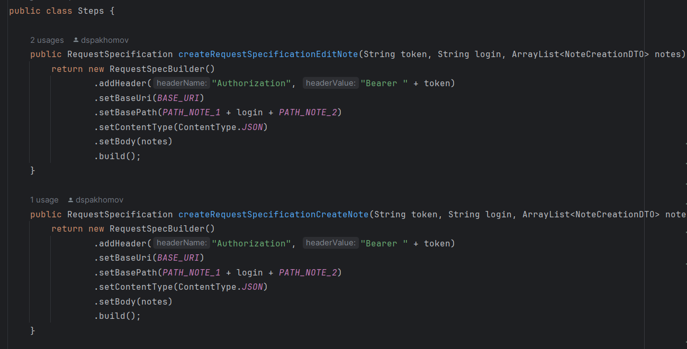
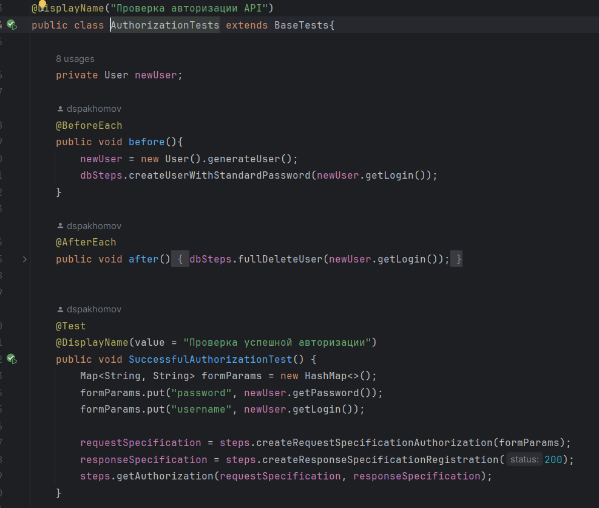
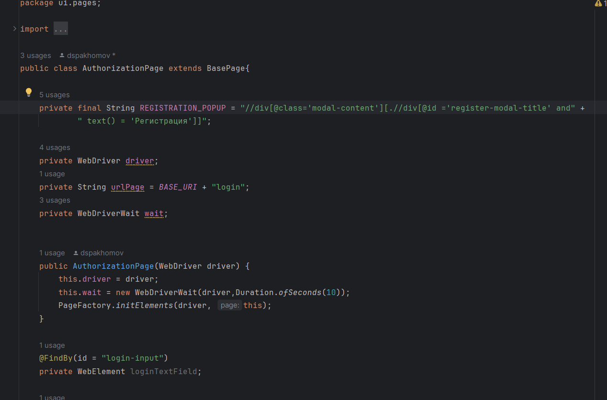
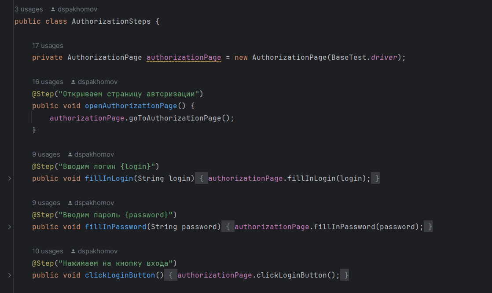
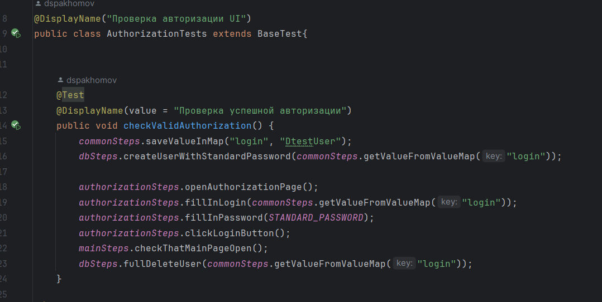
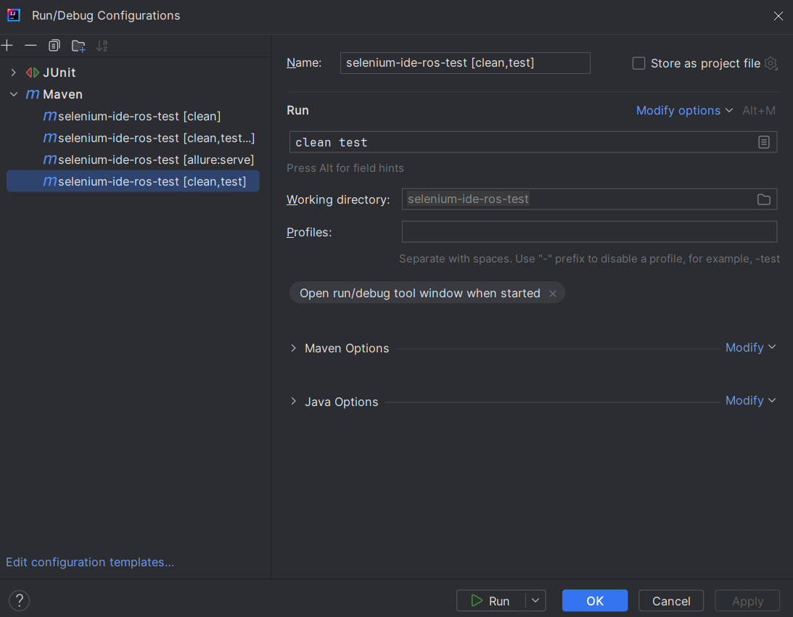

# Финальный проект автотестов

## Структура
Автотесты разделены на api и ui. Соответствующие пакеты с тестами находятся в src/test/java

### Пакет test

#### API
В пакете api находятся следующие пакеты:
steps - методы теста, для сборки запроса, такие как создание RequestSpecification и ResponseSpecification и формирование самого 'скелета' запроса, а также методы по работе с БД

tests - содержит классы тестов авторизации, работы с заметками и регистрации. Также в пакете содержится родительский для других классов тестов класс. В нем содержатся все общие переменные классов тестов

#### UI
В пакете ui содержатся следующие пакеты:
pages - классы описывающие страницы, их элементы и способы работы с ними (Page object)

steps - шаги тестов для более удобного понимания теста, а также для Allure

tests - содержит классы тестов авторизации, работы с заметками и регистрации. Также в пакете содержится родительский для других классов тестов класс. В нем содержатся методы начала тестов и завершения

#### DATA
В пакете data содержатся общие переменные для работы с автотестами. Благодаря этому можно поменять значения в одном месте, и это отразится на всех тестах

#### RESOURCES
В пакете resources содержатся файлы настроек (allure, junit) и ресурсы для файлов

### MAIN
В пакете main содержатся объекты (objects) для работы API, такие как заметка, пользователь и роль

## Запуск тестов
Тесты можно запускать, как с помощью команды maven в терминале
mvn clean test
Так и с помощью конфигурации maven в Idea с параметрами clean test

## Получение отчета о тестировании
Отчет можно получить с помощью команды maven в терминале
Так и с помощью конфигурации maven в Idea с параметрами allure:serve
